### TL:DR;
I was reading this [blog](https://aylinakkus.github.io/how-confident-are-you-chatgpt/) that argued that a part of the success of the reasoning models that achieved gold in IMO is due to their ability to better estimate the confidence of their reasoning which when leveraged via post training RL they develop an internal verifier for their reasoning. [Reasoning models better express their confidence](https://arxiv.org/abs/2505.14489) shows that pure reasoning models already have this ability to express their confidence very accurately. This writeup analyzes whether injecting self doubt in the reasoning CoT of such models affects their confidence at all and to what extent

## Method

I follow the methodology of [Yoon et al](https://arxiv.org/abs/2505.14489) for generating the answer and the confidence of it’s CoT from the model. I use deepseek-ai/DeepSeek-R1-Distill-Qwen’s variant of sizes 1.5B, 7B, 14B and the full test set of GSM8K dataset for all the experiments. I use quantized variants with vllm for inference so I can quickly iterate over experiments
For expressing confidence I ask the model to output it’s confidence in either of the ten bins where each bin has a verbal name and the range value it is associated with. For generating answer and confidence I token force the model with “Answer: …. Confidence:  ….” and then extract the answer and the confidence of it’s CoT
I additionally force the llm to always generate it’s reasoning chain in steps so I can later easily parse the steps from thinking between which I can inject the doubt tokens. I do this by adding the below text just after the first <think> token

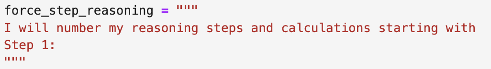

This seems very much robust and reliable and I was almost all the time always able to force the model to reason in steps. I initially used greedy decoding but was not able to get quality reasonings so I use temperature of 0.6, top_p of 0.95 and top_k of 20 for all the experiments and ablations unless stated

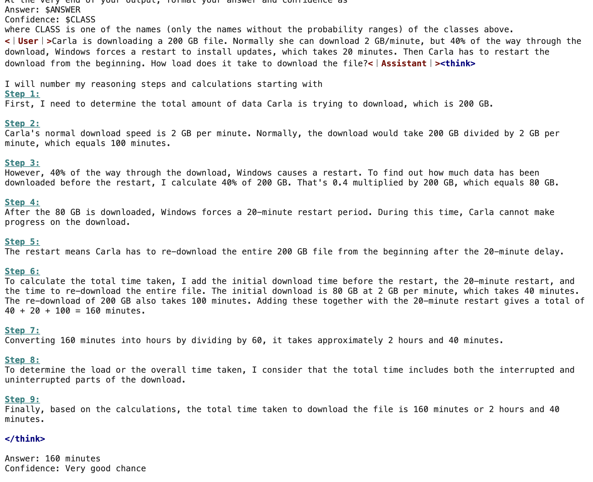

For injecting the doubt in the reasoning CoT of the model, I let the model complete it’s reasoning trace until the </think> token the parse the steps from it and add a new step like “Wait! I seem to have made a mistake” at different positions and then let the model complete from there again upto the </think> token, then I finally force the model to generate answer and confidence with “Answer: … Confidence: ….”. I ablate on the position at which the doubt is injected and it’s affect on the three different models

## Results

### Effect of doubt injection in accuracy and confidence

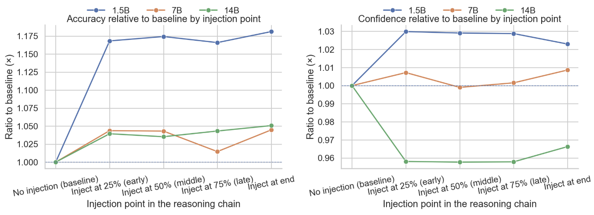

The graph below shows the injection of the doubt in the CoT of the model at various locations for 3 different model sizes. The accuracy is always increased when the doubt is injected in the CoT, the increase in accuracy is greater for smaller models compared to larger models, the position where the doubt was injected affects the most for larger models compared to smaller models where injecting very early or very late seems to give slightly higher accuracy compared to injecting after the middle. This could mean that smaller model commits early to brittle plans and adding a doubt in it’s CoT makes it do some internal checking but I am not sure if this alone is enough to support this claim

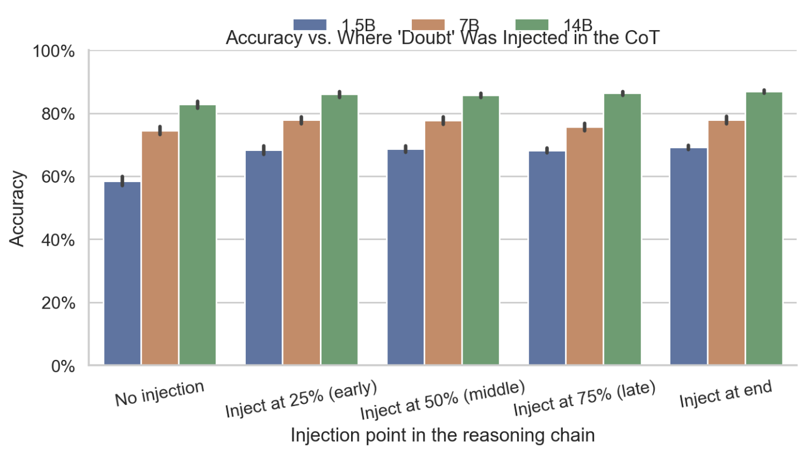

The confidence of the smaller model increases when doubt is injected while when the model is increased the confidence decreases i.e the average confidence of the model decreases for larger models, this again seems to suggest that smaller models commit with higher confidence while larger models hedge. The confidence is higher when the doubt is injected towards the end compared to in between the Co

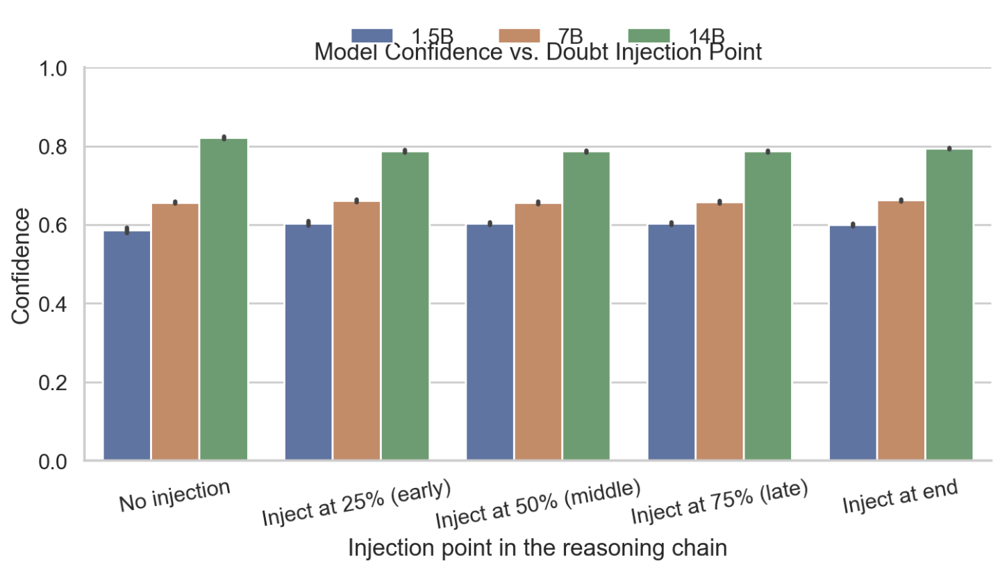

### Calibration Analysis

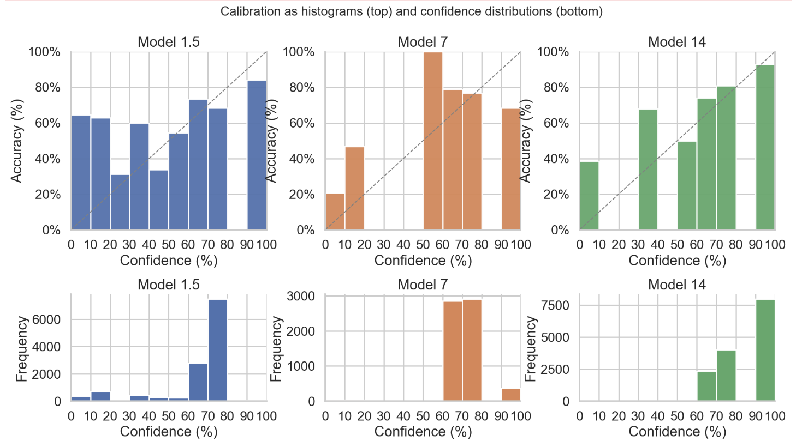

Across all three sizes calibration is at least monotonic and higher stated confidence tends to correspond to higher accuracy but the shape and bias change with scale. The 1.5B model is noisy and mixed: some bins are under-confident, while the top bin is over-confident (accuracy lags its 90-100% claims). By 7B and especially 14B, the bars sit mostly above the calibration line, meaning realized accuracy exceeds reported confidence i.e., the models are conservatively under-confident. The confidence distributions (bottom row) also shift right with scale: 7B concentrates in mid (60-70%) bins, 1.5B around 70-80%, and 14B heavily in 80-100%, with a smoother, more selective use of high-confidence bins. Qualitatively, this looks like better-calibrated and more conservative confidence as models get larger, reducing overconfident errors. Taken with the doubt results, this pattern is consistent with a stronger internal verification signal emerging with scale: bigger models both check more and hedge their stated confidence accordingly

### Distribution of reasoning length across injection positions

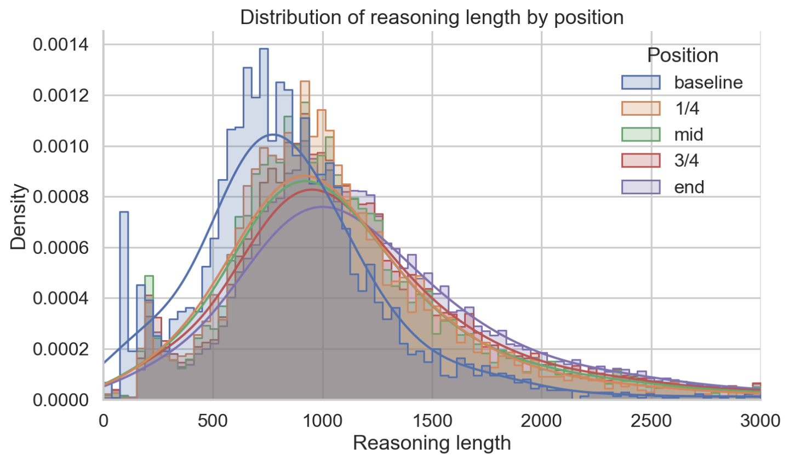

Plotting the distribution of the length of the reasoning tokens shows that injecting the doubt tokens increases the length of the reasoning trace, the order being baseline < mid < end. This was a trivial and expected phenomenon with injecting in the end have to re consider most of the steps while injecting in the mid have to reconsider only some of the steps

### AUROC and Brier Score

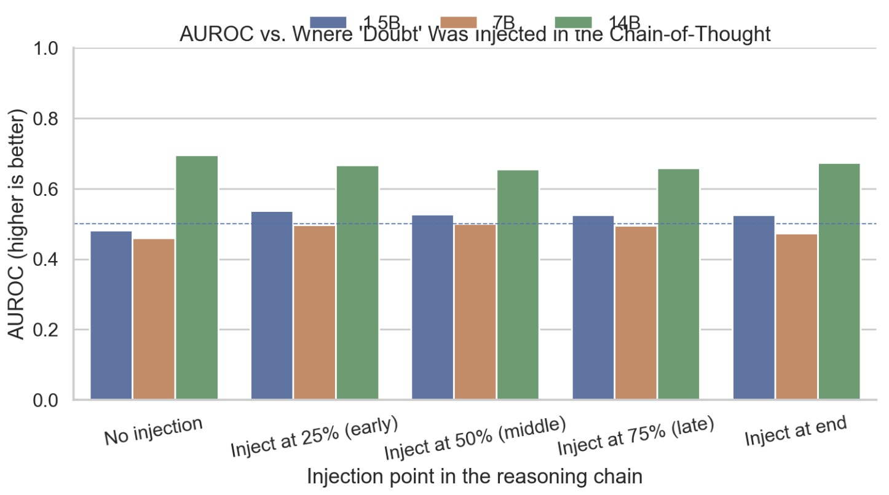

Adding doubt improves the discriminative value of confidence for the 1.5B model, is roughly flat for 7B, and is highest/most stable for 14B (~0.66-0.70 across positions). Early/end insertions give the largest lift on 1.5B, matching the accuracy pattern evidence that doubt helps small models separate correct from incorrect cases, whereas large models already do so robustly

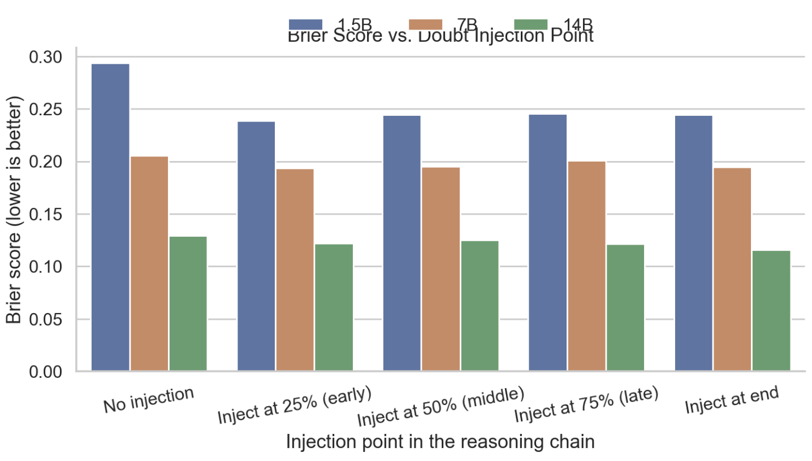

Doubt consistently improves probabilistic calibration 1.5B drops from ~0.29 to ~0.24-0.25, 7B from ~0.20 to ~0.19, and 14B from ~0.13 to ~0.11-0.12, with the best scores typically when injecting at the end. Taken together with AUROC, this suggests doubt increases both ranking quality and probability accuracy largest gains for the smallest model (correcting early overconfidence), smaller but still positive gains for larger models

## Appendix

This is the system prompt that I used asking the model to rate it’s reasoning and answer from 0 to 10 in 10 bins based on how likely it thinks it is correct
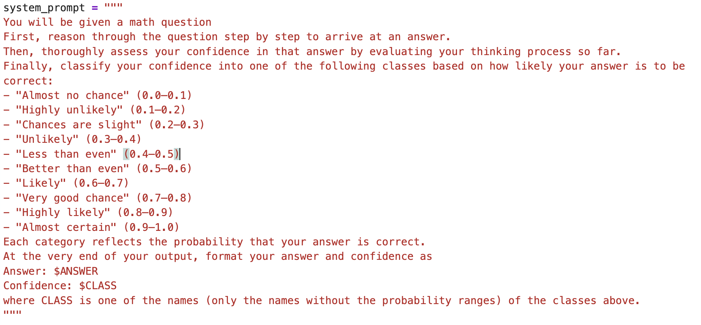

This is how I do doubt injection specifically
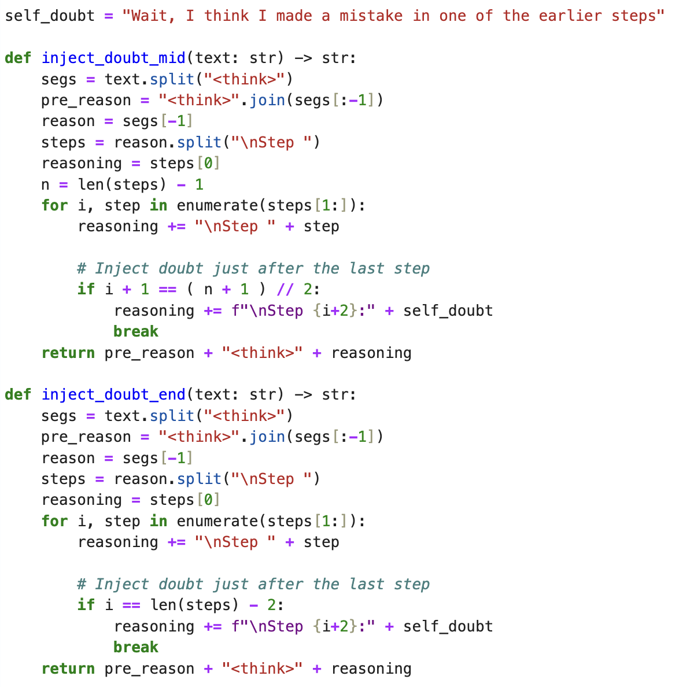

This is how I generate the texts while injecting the doubt tokens in the CoT of the reasoning model
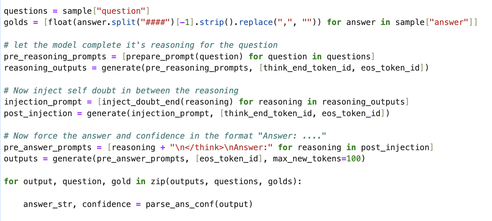
